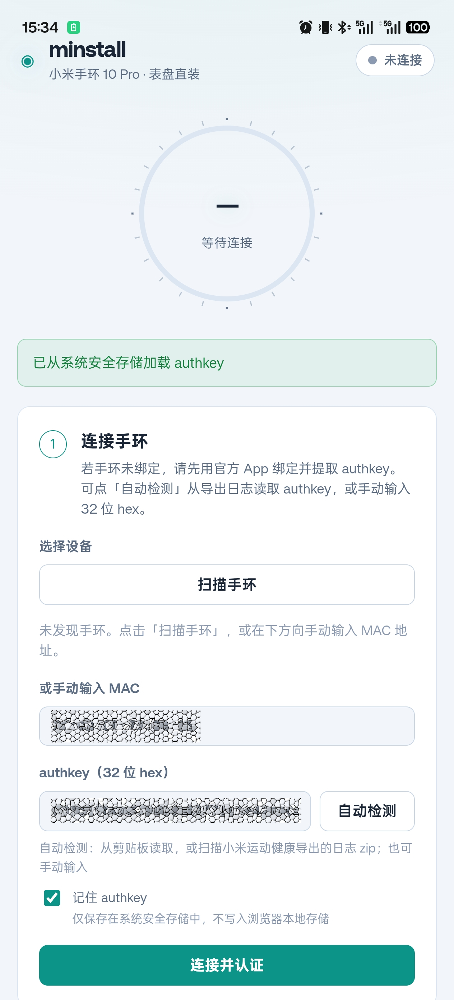
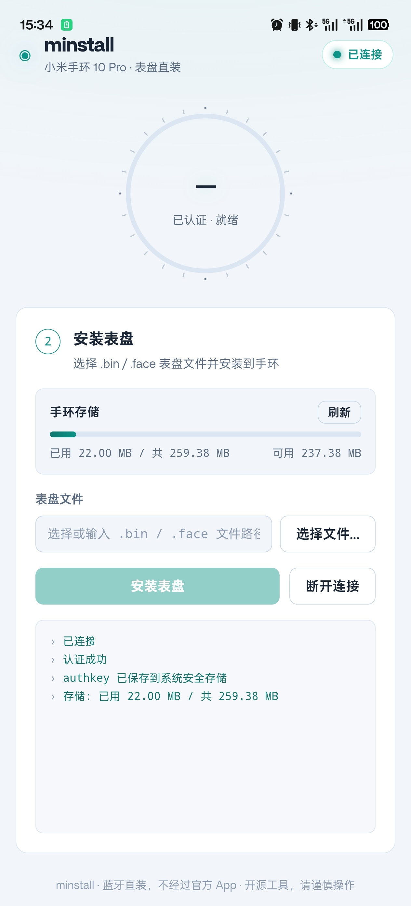

# minstall

> 小米手环 10 Pro 表盘直装工具 —— 蓝牙直连安装 `.bin` / `.face` 表盘，**不经过官方 App**。

支持 **Linux（Tauri 桌面）** 与 **Android（手机端）**。协议层纯 Rust 复用，连接层按平台实现。

> ⚠️ **免责声明**：本项目通过非官方协议逆向实现，绕过官方 App 直连手环，仅供个人研究/自用。使用风险自负（可能违反厂商服务条款；操作不当可能导致手环异常）。请勿用于商业用途，不建议上架应用商店。本项目与 Xiaomi、小米运动健康及相关厂商没有隶属或官方合作关系。

---

## ✨ 特性

- 🎯 蓝牙直连，不依赖官方 App（可替代 AstroBox）
- 📱 双平台：Linux 桌面 + Android 手机
- 🔑 authkey 自动读取（剪贴板 / 导出日志解析）
- 📦 安装 `.bin` / `.face` 表盘，进度实时显示
- 💾 手环存储用量查询
- 🎨 深色 / 浅色双主题

## 📸 截图

### Android：连接手环



### Android：认证后安装表盘



> 截图中的 MAC 地址和 authkey 已脱敏。

---

## 🚀 快速开始（Android 用户）

1. **下载 APK**：从 [Releases](https://github.com/HyperionD/minstall/releases) 下载最新版并安装
2. **准备 authkey**：
   - 用官方 App（小米运动健康）绑定手环
   - 我的 → 关于 → 连续点击界面最上方的 App 图标 → 弹出对话框点「确定」导出日志
   - 打开 minstall，点「自动检测」自动读取；或从日志 `Download/wearablelog/*.zip` 中手动提取 `"encryptKey"` 字段值（32 位 hex）
3. **连接**：扫描或输入手环 MAC（如 `2C:0D:CF:73:D9:95`），输入 authkey，勾选“记住 authkey”（可选），点「连接并认证」
4. **安装**：选择 `.bin` / `.face` 表盘文件 → 点「安装表盘」→ 进度 100% 后到手环确认

### 使用注意事项

- authkey 是与手环绑定状态相关的敏感凭据。勾选“记住 authkey”后，Linux 使用 Secret Service、Android 使用 Android Keystore 保存；不会写入浏览器 `localStorage`。
- 使用前请**关闭/退出官方 App**（它会占用手环的蓝牙 RFCOMM 通道；minstall 会自动尝试顶掉占用，但建议手动退出更稳定）
- 手环必须处于**已绑定**状态（未恢复出厂 / 未在 App 内解绑），否则认证返回 NO_BOUND
- 重新绑定后需重新提取 authkey

---

## 🛠 开发 / 构建

> 完整开发背景、协议细节、平台实现、踩坑记录见 [`DEVELOPMENT.md`](DEVELOPMENT.md)（AI 后续开发必读）。

### 环境要求

| 组件 | 版本 |
|---|---|
| Rust | stable（target: `aarch64-linux-android` 等） |
| Node.js | 18+ |
| JDK | 17 |
| Android SDK | platform 36 + build-tools 36 + NDK 27.1 |
| cargo-ndk | 最新 |

### Linux 桌面

当前桌面端支持 **Linux + BlueZ + 经典蓝牙 SPP**。Secret Service 不可用时，系统不会回退到明文文件保存 authkey。

```bash
npm install
cd src-tauri && cargo test    # 协议与安全存储单测
cd ..
npm run tauri dev
```

### Android APK

```bash
export JAVA_HOME=~/path/to/jdk-17
export ANDROID_HOME=~/Android/Sdk
npm run tauri android build -- --apk
# 产物：src-tauri/gen/android/app/build/outputs/apk/universal/release/app-universal-release.apk
```

**签名**：release 构建会自动读取 `src-tauri/gen/android/keystore.properties`（含密钥路径/口令）。此文件已被 gitignore，**不要提交**；需自行生成 keystore：

```bash
keytool -genkeypair -v \
  -keystore ~/minstall-release.keystore \
  -alias minstall -keyalg RSA -keysize 2048 -validity 36500 \
  -storepass <你的口令> -keypass <你的口令>
# 然后填写 src-tauri/gen/android/keystore.properties
```

> ⚠️ 密钥请**离线妥善备份**：丢失后用户无法升级已安装的 App。

---

## 📖 协议简述（详细见 DEVELOPMENT.md）

- Band 10 Pro 的 V2 协议走 **经典蓝牙 SPP 通道（RFCOMM ch5）**，非 BLE GATT
- 协议族为 **astrobox 的 WearPacket**（非 Gadgetbridge 的 Command，两者字节兼容但语义不同）
- 认证：V1 Hello → START_SESSION → authkey 认证（PhoneNonce/WatchNonce/HMAC）
- 安装：WatchFace PREPARE → Mass PREPARE → MASS 分片上传（BATCH=2）→ InstallResult

## 🔐 权限与隐私

Android 需要蓝牙连接/扫描权限；自动读取官方 App 导出日志时还会请求剪贴板读取和 Android「所有文件访问」权限。所有文件访问仅用于扫描 `Download/wearablelog` 中的导出日志，不上传任何数据。

项目不包含遥测、账号系统或网络服务。问题反馈时请勿附带 authkey、导出日志或包含设备身份信息的完整日志。

## 🗂 项目结构

```
src/            React 前端
src-tauri/src/
  ble/          蓝牙层（Linux bluer / Android JNI）
  protocol/     协议层（纯 Rust，双平台复用）
  commands.rs   Tauri command 桥接
pocs/           Python POC 脚本
```

## 📄 License

[MIT](LICENSE) © 2026 minstall contributors。第三方参考和非官方声明见 [`NOTICE`](NOTICE)。

- [贡献指南](CONTRIBUTING.md)
- [安全问题报告](SECURITY.md)
- [变更记录](CHANGELOG.md)

---

## ⚠️ 已知限制

- 当前只支持 Linux 桌面和 Android；macOS、Windows 尚未实现蓝牙连接层。
- 仅针对小米手环 10 Pro 的已验证协议流程；其他型号或固件可能无法工作。
- 表盘传输成功不一定代表手环已经完成安装，部分固件不会推送 InstallResult。
- 反复安装可能累积手环存储，建议使用官方 App 定期清理。
- authkey 与手环绑定状态关联；重新绑定后需要重新提取。

## 🙏 致谢

- [Gadgetbridge](https://github.com/Freeyourgadget/Gadgetbridge) / [Kodo](https://github.com/kidneyweakx/Kodo)（Band 9 协议参考）
- [AstroBox](https://github.com/AstralSightStudios/AstroBox-NG)（Band 10 Pro WearPacket 协议参考）
